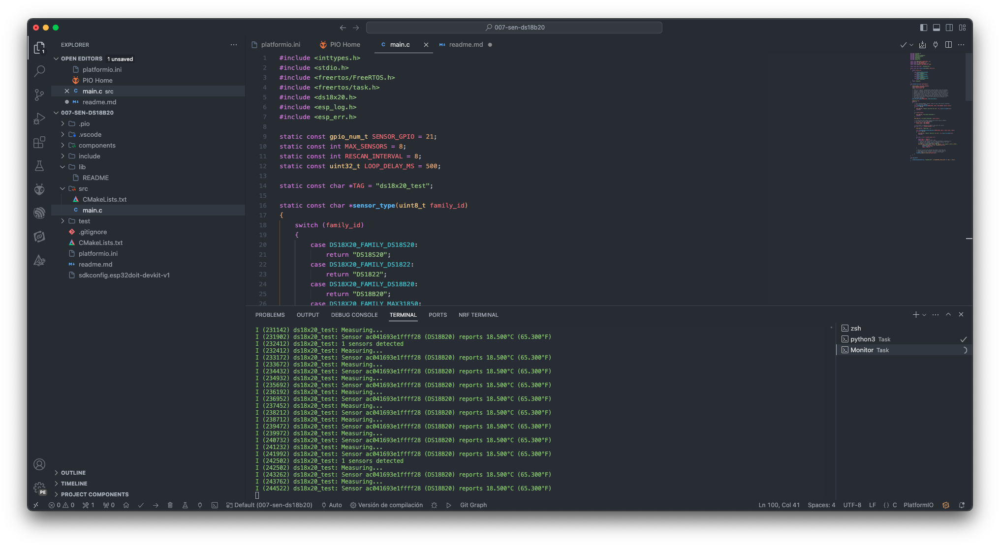

# Estudio sensor ds18x20

Fuente de información: [ESP-IDF Components library](https://github.com/UncleRus/esp-idf-lib/tree/master/examples/ds18x20)

## Temas estudiados

- [x] Uso de componentes, en este caso sensor ds18x20 con un ejemplo de la librería oficial.

