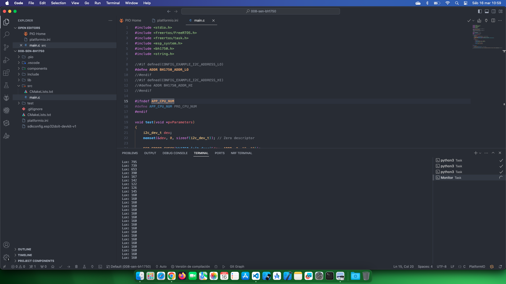

# Estudio sensor bh1750

Fuente de información: [ESP-IDF Components library](https://github.com/UncleRus/esp-idf-lib/tree/master/examples/bh1750/default)

## Temas estudiados

- [x] Uso de componentes, en este caso sensor bh1750 con un ejemplo de la librería oficial.

