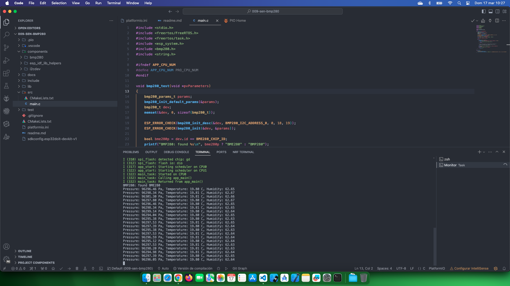

# Estudio sensor BMP280

[ESP-IDF Components library](https://github.com/UncleRus/esp-idf-lib/tree/master/examples/bmp280/default)

## Temas estudiados

- [x] Uso de componentes, en este caso sensor bmp280 con un ejemplo de la librería oficial.

