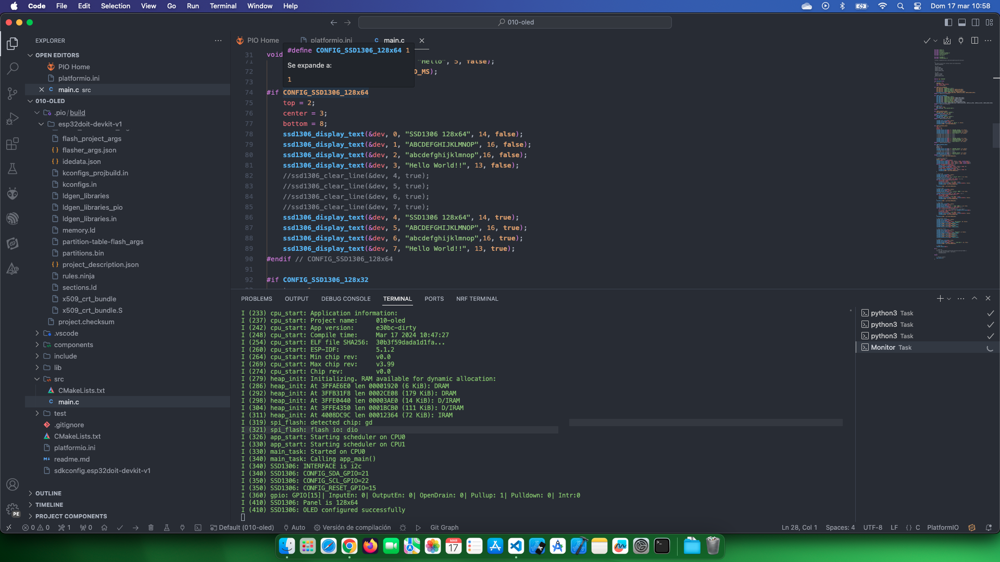

# Estudio OLED 

Fuente de información: [Interface OLED with ESP32 using ESP-IDF](https://esp32tutorials.com/oled-esp32-esp-idf-tutorial/)

## Temas estudiados

- [x] Uso de OLED con ESP32.

Fuente de información: [Demo) OLED with ESP32 using ESP IDF Display and Scrolling text Example](https://www.youtube.com/watch?v=9v-5XzEFTvw)

