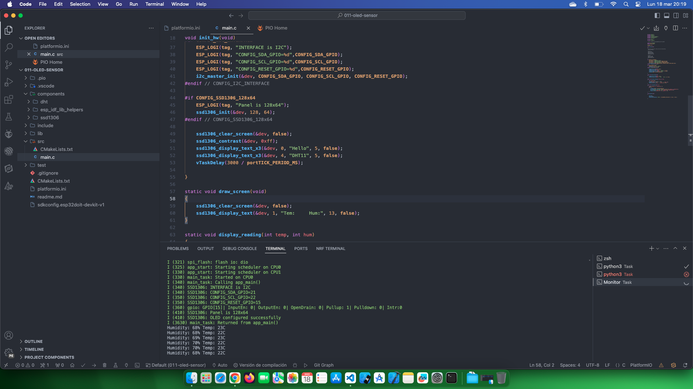

# Estudio OLED mas sesnor DHT11

Fuente de información: [esp-idf-ssd1306](https://github.com/nopnop2002/esp-idf-ssd1306)

## Temas estudiados

- [x] Uso de OLED y sensor DHT11 refrescando datos mediante una tarea

