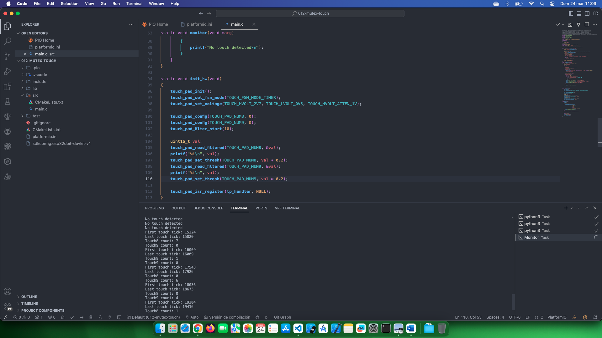

# Estudio FreeRTOS

Fuente de información: [Touchpad Example](https://github.com/PacktPublishing/Internet-of-Things-with-ESP32/tree/main/ch3/touchpad_example)

## Temas estudiados

- [x] Uso de un mutex para proteger variables globales.

