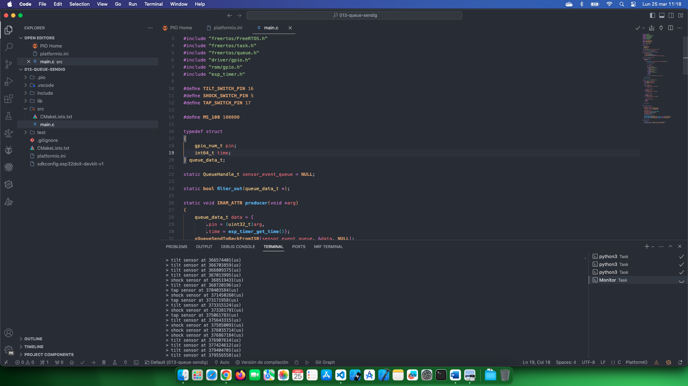

# Estudio FreeRTOS

[Touchpad Example](https://github.com/PacktPublishing/Internet-of-Things-with-ESP32/tree/main/ch3/freertos_queue_ex)

## Temas estudiados

- [x] Uso de colas para comunicaciones entre tareas. En este caso enviamos una estructura cuando algún sensor digital se activa. 

