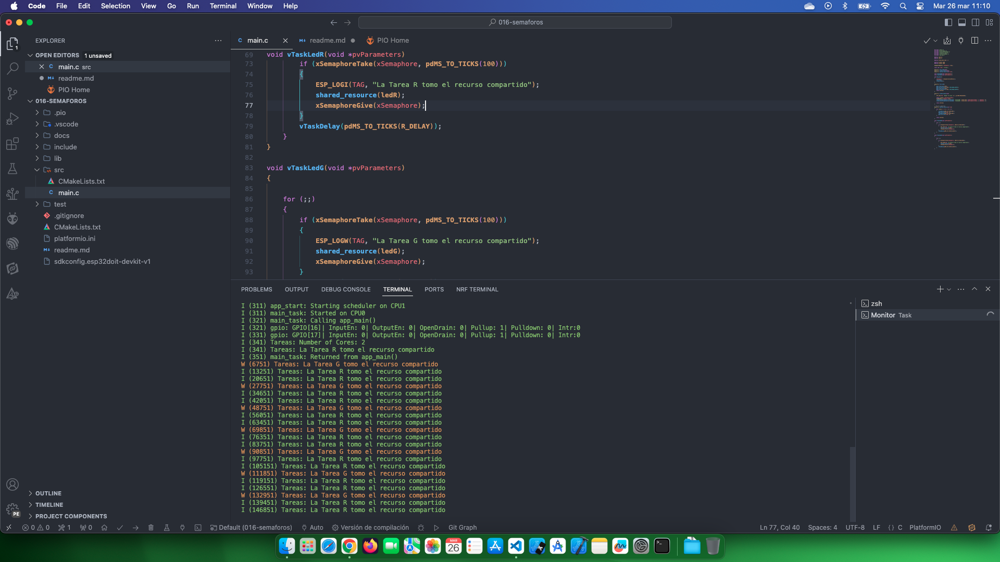

# Estudio FreeRTOS Semaforos Mutex

[FreeRTOS Semaforos Mutex](https://www.youtube.com/watch?v=xWk1hshwGqk&list=PL-Hb9zZP9qC65SpXHnTAO0-qV6x5JxCMJ&index=13)

## Temas estudiados

- [x] Uso de semaforo mutex básico. 

