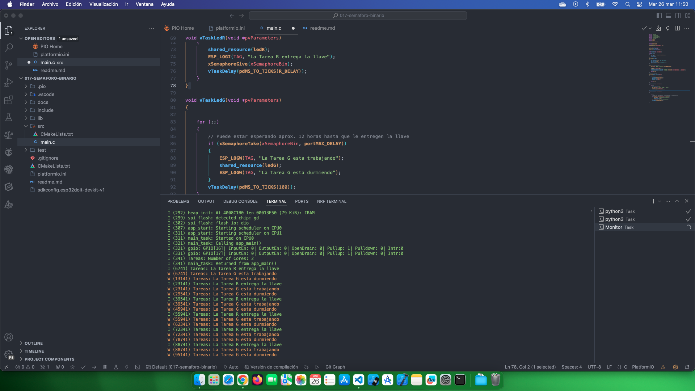

# Estudio FreeRTOS Semaforos Binarios

[FreeRTOS Semaforos Binarios](https://www.youtube.com/watch?v=8dGv1kRkLPs&list=PL-Hb9zZP9qC65SpXHnTAO0-qV6x5JxCMJ&index=14)

## Temas estudiados

- [x] Uso de semaforo binario básico. 

