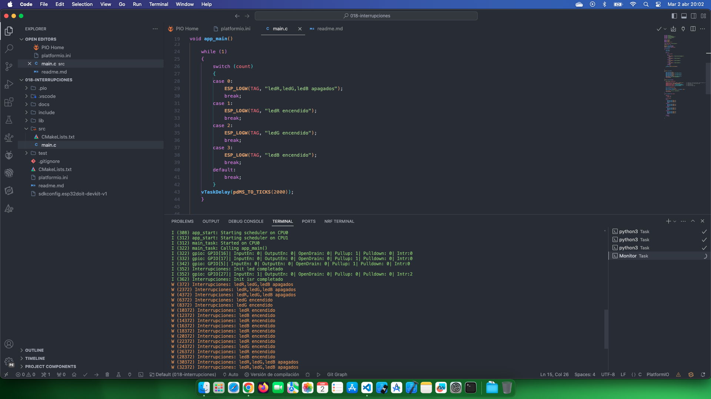

# Estudio Interrupciones

Fuente de información: [Interrupciones externas/push button](https://www.youtube.com/watch?v=OiKF7yPsxXM&list=PL-Hb9zZP9qC65SpXHnTAO0-qV6x5JxCMJ&index=15)

## Temas estudiados

- [x] Uso de interrupción mediante boton. 

