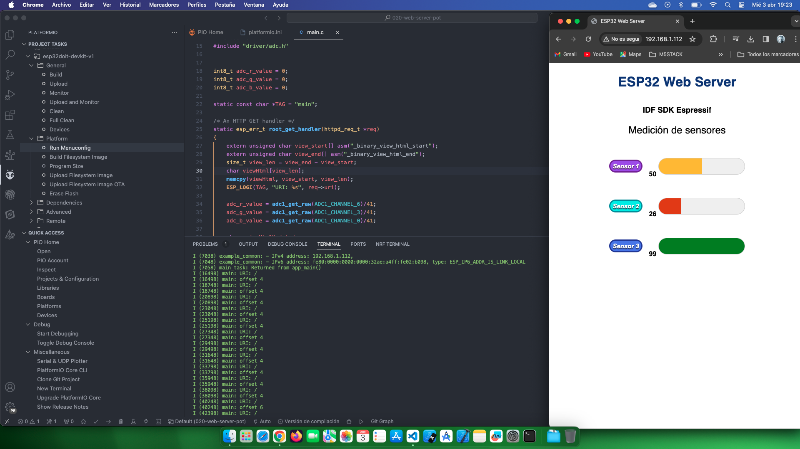

# Estudio Web Server con Potenciometros

[ Web Server/ Sensores](https://www.youtube.com/watch?v=_pi8zm_43EQ&list=PL-Hb9zZP9qC65SpXHnTAO0-qV6x5JxCMJ&index=17)

## Temas estudiados

Siguiendo el tutorial al hacerlo en platformio he tenido que hacer algunos ajustes

Estos archivos #include los he tenido que buscar en la instalación .platformio  

#include "protocol_examples_common.h"   
#include "esp_https_server.h"  

Para el archivo html, además del CMakeLists.txt he tenido que modificar el platformio.ini, pero al final todo funciona. 

- [x] Crear un Web server para leer unos potenciometros en el adc.

