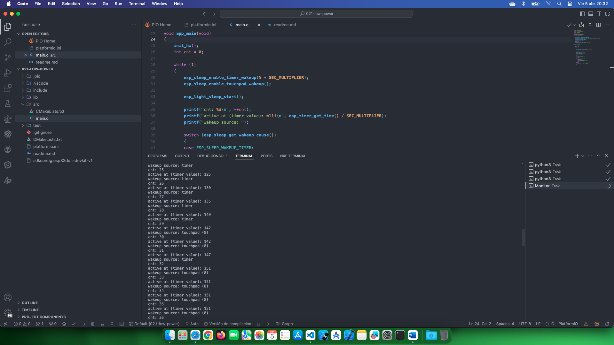

# Estudio para desarrollar aplicaciones de bajo consumo 

Fuente de información: [Low Power](https://github.com/PacktPublishing/Internet-of-Things-with-ESP32/blob/main/ch4/lsleep_example/src/main.c)

## Temas estudiados

Hay cinco modos de energía predefinidos de ESP32:  

• Activo: Todos los componentes del ESP32 están encendidos, sin ahorro de energía. En todos los ejemplos hasta este momento, nuestro kit de desarrollo estaba en ese modo.  

• Modo de suspensión del módem: aquí, Wi­Fi y Bluetooth están deshabilitados, sin radio comunicación. Para estos tipos de sistema en chip (SoC) , la radio está a la cabeza en términos de consumo de energía. Por lo tanto, cuando apagamos la radio, supone una gran diferencia en el ahorro de energía.  

• Modo de suspensión ligera: el reloj de alta velocidad y todos los componentes dependientes se detienen. Los núcleos y la RAM todavía están encendidos pero no disponibles para su uso. Están disponibles funciones de bajo consumo y el procesador ULP. ESP32 conserva el estado de la aplicación, por lo que es fácil y rápido reactivarla. El consumo actual ronda los 800 μA.  

• Modo de suspensión profunda: en este estado, ESP32 está completamente en funcionamiento de bajo consumo. Los núcleos y la RAM están apagados, por lo que tenemos que usar la memoria RTC para cualquier retención de datos. El consumo actual es de alrededor de 6,5 μA.  

• Hibernación: el procesador ULP también está apagado y ESP32 no tiene ninguna capacidad de cálculo en este modo. Sólo el subsistema RTC está disponible para activar el sistema cuando ocurre un evento externo.

- [x] En este ejemplo, mantendremos ESP32 en modo de suspensión ligera.

Como fuentes de despertador usaremos un temporizador para despertares periódicos y un sensor táctil para despertares basados en eventos. No habrá ningún componente de hardware adicional excepto un cable de conexión para el sensor táctil.  

