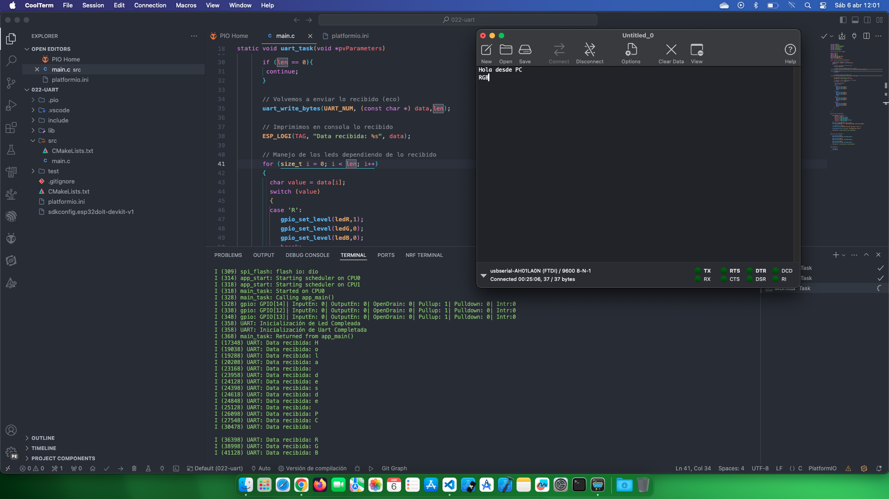

# Estudio Uart

Fuente de información: [Universal Asynchronous Receiver/Transmitter](https://docs.espressif.com/projects/esp-idf/en/stable/esp32/api-reference/peripherals/uart.html)

Fuente de información: [Comunicación serial/ UART con Polling](https://www.youtube.com/watch?v=7ZmEhe-Eedw&list=PL-Hb9zZP9qC65SpXHnTAO0-qV6x5JxCMJ&index=19)

## Temas estudiados

- [x] Crear una comunicación Uart para controlar unos led RGB. 

