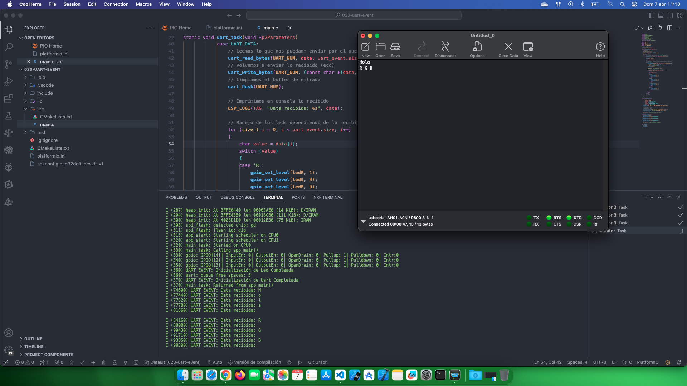

# Estudio Uart

Fuente de información: [Comunicación serial/ UART con Eventos](https://www.youtube.com/watch?v=f3gVk8FahRI&list=PL-Hb9zZP9qC65SpXHnTAO0-qV6x5JxCMJ&index=20)

## Temas estudiados

- [x] Crear una comunicación Uart con eventos para controlar unos led RGB. 

