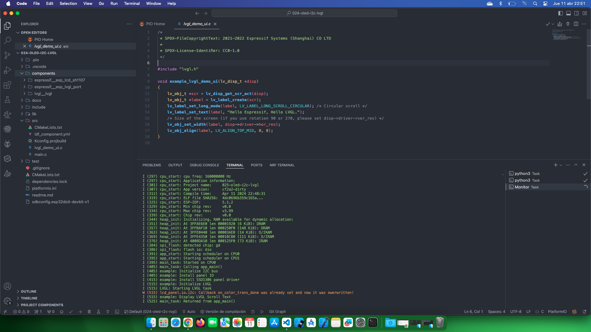

# Estudio OLed con LVGL

Fuente de información: [LCD](https://docs.espressif.com/projects/esp-idf/en/stable/esp32/api-reference/peripherals/lcd.html)

## Temas estudiados

- [x] Usar la librería LVGL con una pantalla Oled SSD1306. 

