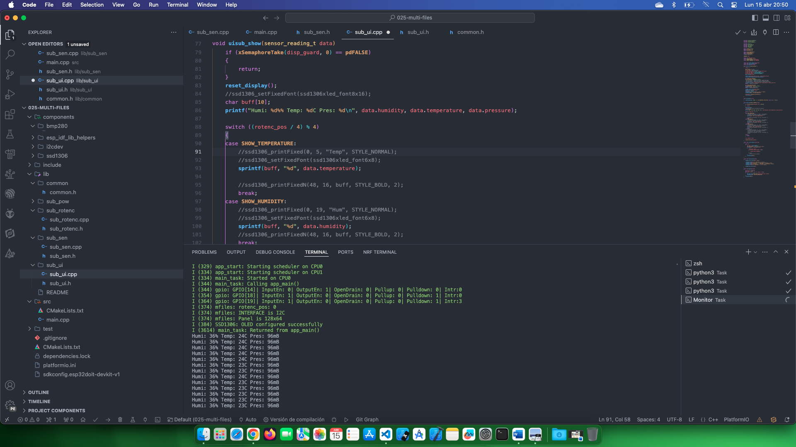

# Estudio de múltiples sensores y multiples archivos 

Fuente de información: [Multisensor](https://github.com/PacktPublishing/Internet-of-Things-with-ESP32/tree/main/ch5)

## Temas estudiados

- [x] Uso de componentes, y multiples archivos.

